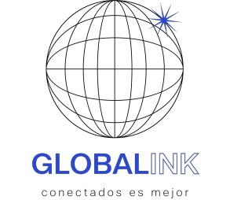

# 🌐Globalink

<br/>



## Descripción

<p>Globalink es una red social que permite a las personas conectarse y compartir intereses específicos dentro de "mundos" temáticos. Nuestra misión es conectar a personas de todo el mundo que compartan intereses en común, facilitando la creación de redes significativas y personalizadas. En Globalink, valoramos el respeto, la inclusividad y la autenticidad, y nos esforzamos por crear una experiencia de usuario enriquecedora y relevante. Queremos ser la plataforma líder en la conexión de usuarios interesados en los mismos tópicos, asegurando que cada interacción sea enfocada y satisfactoria</p>

## Rubro
#### WebApp
Global Link es una aplicación de redes sociales.

<br/>

## Tecnologías Utilizadas

### Front End

[](https://skillicons.dev)

### Back End

[](https://skillicons.dev)

### Diseño

[](https://skillicons.dev)

### Gestion de Proyecto

<p>Para poder comunicarnos utilizamos las herramientas de Trello, Meet, Slack y Whatsapp.</p>

<br/>

## Colaboradores

<br/>

| Integrantes | Roles | Linkedin | Github |
| ----------- | ----- | -------- | ------ |
| Lorena Tito Ramos | Team Leader (TL) | []()  | []()|
| Eliane | UI/UX | []()  | []()|
| David Yánez | Frontend | [](https://www.linkedin.com/in/david--yanez)  | [](https://github.com/David-Yanez)|
| Nahuel Herrera | Backend & Support | [](https://www.linkedin.com/in/nahuel-rodrigo-herrera-a297b31b9/)  | [](https://github.com/Nahuehue)|
| Maximiliano | Backend | []()  | []()|
| André | Frontend/Backend | []()  | []()|
| Urueña Carlos | Backend | []()  | []()|
| Lissbeth Escobar | Frontend | [](https://www.linkedin.com/in/lissbethe)  | [](https://github.com/LissbethE)|

<br/>

## Instrucciones para ejecutar el proyecto

<p>Para instalar las dependencias y ejecutar el proyecto, sigue estos pasos:</p>

```sh
npm install
npm run dev start
```
iniciar Server para desarrollo web
```sh
npm run dev
```
## Enlaces del proyecto
| Figma | Trello | Mas sobre nosotros | Tecnico |
|-------|--------|-------------------|---------------|
|[](https://www.figma.com/design/F5V2Gx1GoF2veVFsPD9Hn2/GLOBALink?node-id=0-1&t=ummJICCQ8wa715Kw-0)|[](https://trello.com) | [](https://www.canva.com/design/DAGLaMiEPcU/WwfgUNTqXlbj9IXzX9d_Bw/edit?utm_content=DAGLaMiEPcU&utm_campaign=designshare&utm_medium=link2&utm_source=sharebutton) | [](https://www.canva.com/design/DAGLaMiEPcU/WwfgUNTqXlbj9IXzX9d_Bw/edit?utm_content=DAGLaMiEPcU&utm_campaign=designshare&utm_medium=link2&utm_source=sharebutton) |        
